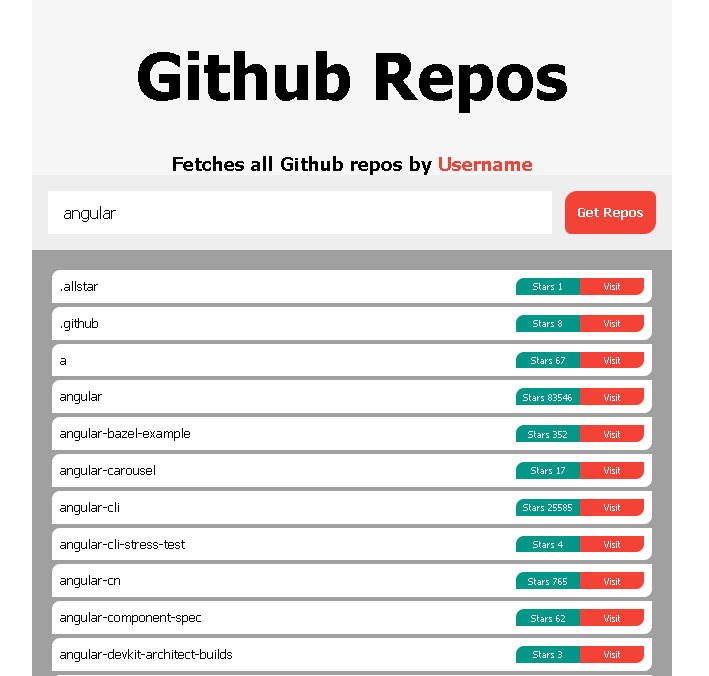

# GitHub Repos fetcher

> By Username, this app fetches all Github Repos in a list with
> the name, stars, and Repository Link.

## Built With

- HTML
- Css
- JavaScript
- fetch(API)

## Live Demo (if available)

[Start Game](https://muhmmdusama.github.io/JS-practice-proj-03-Memory-Game/)

## Authors

##👤 Author

- GitHub: [@muhmmdusama](https://github.com/muhmmdusama)
- Twitter: [@muhmmdusama](https://twitter.com/muhmmdusama)
- LinkedIn: [muhmmdusama](https://linkedin.com/in/muhmmdusama)

## 🤝 Contributing

Contributions, issues, and feature requests are welcome!

## Show your support

Give a ⭐️ if you like this project!

## 📝 License

This project is [MIT](./MIT.md) licensed.
